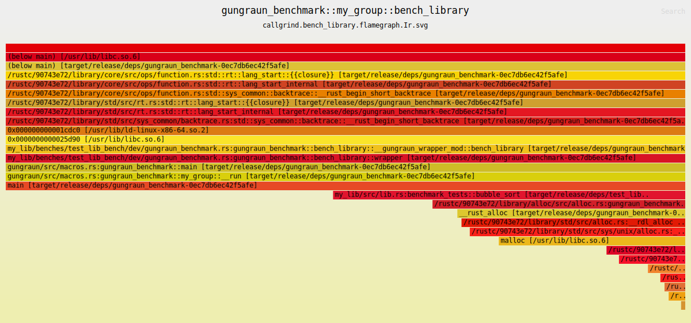
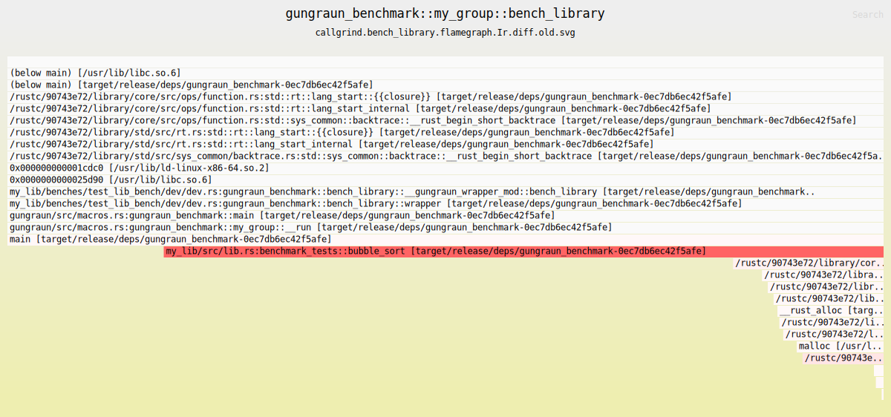

# Callgrind Flamegraphs

Flamegraphs are opt-in and can be created if you pass a `FlamegraphConfig` to
the `BinaryBenchmarkConfig` or `LibraryBenchmarkConfig`. Callgrind flamegraphs
are meant as a complement to valgrind's visualization tools
`callgrind_annotate` and `kcachegrind`.

For example create all kind of flamegraphs for all benchmarks in a library
benchmark:

```rust
# extern crate iai_callgrind;
# mod my_lib { pub fn bubble_sort(_: Vec<i32>) -> Vec<i32> { vec![] } }
use iai_callgrind::{
    library_benchmark, library_benchmark_group, main, LibraryBenchmarkConfig,
    FlamegraphConfig
};
use std::hint::black_box;

#[library_benchmark]
fn bench_library() -> Vec<i32> {
    black_box(my_lib::bubble_sort(vec![3, 2, 1]))
}

library_benchmark_group!(name = my_group; benchmarks = bench_library);

# fn main() {
main!(
    config = LibraryBenchmarkConfig::default()
        .flamegraph(FlamegraphConfig::default());
    library_benchmark_groups = my_group
);
# }
```

The produced flamegraph `*.svg` files are located next to the respective
callgrind output file in the `target/iai`
[directory](./cli_and_env/output/out_directory.md).

## Regular Flamegraphs

Regular callgrind flamegraphs show the inclusive costs for functions and a
single `EventKind` (default is `EventKind::Ir`), similar to
`callgrind_annotate`. Suppose the example from above is stored in a benchmark
`iai_callgrind_benchmark`:



If you open this image in a new tab, you can play around with the svg.

## Differential Flamegraphs

Differential flamegraphs facilitate a deeper understanding of code sections
which cause a bottleneck or a performance regressions etc.



We simulated a small change in `bubble_sort` and in the differential flamegraph
you can spot fairly easily where the increase of `Instructions` is happening.
